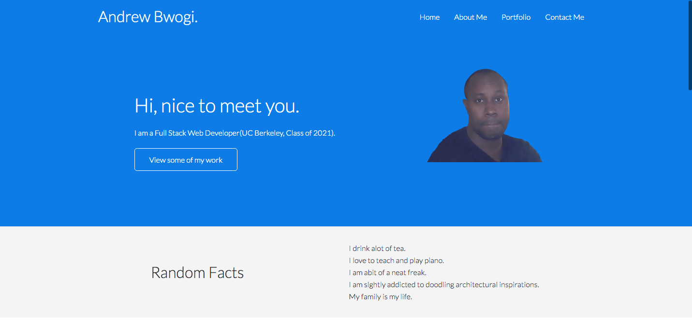

# My New Portfolio 

## The Repository

This repository ("`myNewPortfolio`") is where i have developed my new Portfolio [My New Portfolio](https://bwogi.github.io/myNewPortfolio/). This source code is available  [Here](https://github.com/Bwogi/myNewPortfolio).

## The Portfolio

  

## Contributing

There are many ways in which you can participate in the project, for example:

* [Submit bugs and feature requests](https://github.com/Bwogi/myNewPortfolio/issues), and help us verify as they are checked in
* Review [source code changes](https://github.com/Bwogi/myNewPortfolio/pulls    )
* Review the [documentation](https://github.com/Bwogi/myNewPortfolio/wiki) and make pull requests for anything from typos to new content

## Feedback

* [File an issue](https://github.com/Bwogi/myNewPortfolio/issues)
* Follow [@andrewbwogi](https://twitter.com/andrewbwogi) and let us know what you think!

See our [wiki](https://github.com/Bwogi/myNewPortfolio/wiki/Feedback-Channels) for a description of each of these channels and information on some other available community-driven channels.

## Related Projects

<!-- Many of the core components and extensions to VS Code live in their own repositories on GitHub. For example, the [node debug adapter](https://github.com/microsoft/vscode-node-debug) and the [mono debug adapter](https://github.com/microsoft/vscode-mono-debug) have their own repositories. For a complete list, please visit the [Related Projects](https://github.com/microsoft/vscode/wiki/Related-Projects) page on our [wiki](https://github.com/microsoft/vscode/wiki). -->

## Bundled Extensions

<!-- VS Code includes a set of built-in extensions located in the [extensions](extensions) folder, including grammars and snippets for many languages. Extensions that provide rich language support (code completion, Go to Definition) for a language have the suffix `language-features`. For example, the `json` extension provides coloring for `JSON` and the `json-language-features` provides rich language support for `JSON`. -->

## Development Container

<!-- This repository includes a Visual Studio Code Remote - Containers / Codespaces development container.

- For [Remote - Containers](https://aka.ms/vscode-remote/download/containers), use the **Remote-Containers: Open Repository in Container...** command which creates a Docker volume for better disk I/O on macOS and Windows.
- For Codespaces, install the [Visual Studio Codespaces](https://aka.ms/vscs-ext-vscode) extension in VS Code, and use the **Codespaces: Create New Codespace** command.

Docker / the Codespace should have at least **4 Cores and 6 GB of RAM (8 GB recommended)** to run full build. See the [development container README](.devcontainer/README.md) for more information. -->

## Code of Conduct

<!-- This project has adopted the [Microsoft Open Source Code of Conduct](https://opensource.microsoft.com/codeofconduct/). For more information see the [Code of Conduct FAQ](https://opensource.microsoft.com/codeofconduct/faq/) or contact [opencode@microsoft.com](mailto:opencode@microsoft.com) with any additional questions or comments. -->

## License

Licensed under the [MIT](LICENSE.txt) license.